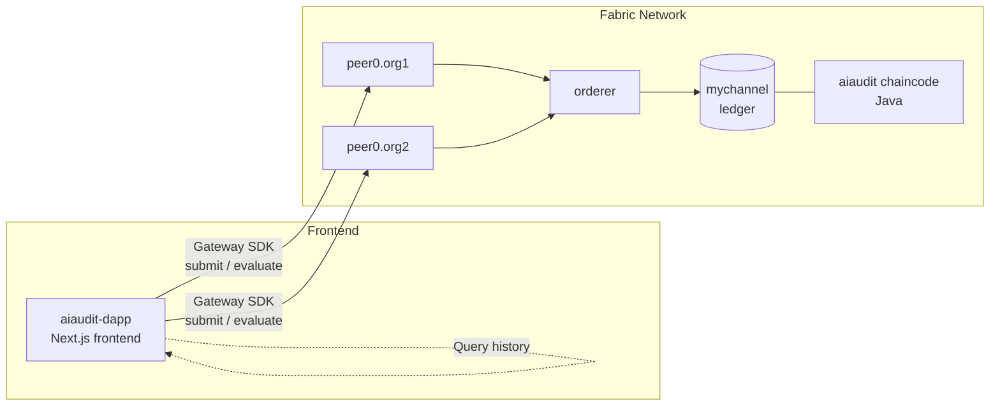

# AI-Audit: Model Integrity Ledger

A decentralized audit log for AI models built on **Hyperledger Fabric**. AI-Audit records the cryptographic hash of a model on a permissioned blockchain ledger at registration time, so any party can later verify the model has not been tampered with by comparing its current hash against the immutable on-chain history.

## Architecture



- **Network**: Two-organization Fabric network (Org1, Org2), one Raft orderer, channel `mychannel`. Endorsement requires both orgs to approve a chaincode definition before it can be committed — this is what makes the ledger "permissioned" rather than a plain database.
- **Chaincode** (`chaincode/aiaudit`): a Java smart contract (`AIContract`) exposing three transactions:
  - `auditModel(modelID, hashValue, owner)` — writes a new hash record for a model to the ledger.
  - `verifyModel(modelID)` — reads the current state for a model.
  - `getModelHistory(modelID)` — returns the full transaction history for a model key, i.e. every hash it has ever been registered with, in order. This is what makes tampering detectable: if a model's hash changes without a corresponding new `auditModel` transaction, the current file no longer matches any hash on record.
- **Frontend** (`aiaudit-dapp`): a Next.js app that connects to the network via the Fabric Gateway SDK using a wallet identity, and exposes Server Actions (`createAuditRecord`, `getModelHistory`) that call the chaincode's `submitTransaction`/`evaluateTransaction`.

## Tech Stack
- **Frontend:** Next.js 15/16, TypeScript, Tailwind CSS
- **Blockchain:** Hyperledger Fabric v2.5, Docker
- **Chaincode:** Java (Gradle)
- **SDK:** fabric-network (Node.js Gateway API)

## Prerequisites

- **Docker Engine 24.x** (tested on 24.0.7). **Do not use Docker Engine 26+** — Fabric 2.5's chaincode lifecycle has a known incompatibility with newer Docker Engine versions: `peer lifecycle chaincode install` fails with `docker build failed: ... write unix @->/run/docker.sock: write: broken pipe` during the chaincode build step. Pin your version:
```bash
  sudo apt install -y docker-ce=5:24.0.7-1~ubuntu.22.04~jammy docker-ce-cli=5:24.0.7-1~ubuntu.22.04~jammy containerd.io
  sudo apt-mark hold docker-ce docker-ce-cli containerd.io
```
- Node.js 18+
- Java 11+ and Gradle
- [Hyperledger fabric-samples](https://github.com/hyperledger/fabric-samples), fabric binaries, and matching Docker images (v2.5.4), installed via:
```bash
  curl -sSL https://raw.githubusercontent.com/hyperledger/fabric/main/scripts/bootstrap.sh | bash -s -- 2.5.4
```
  This clones `fabric-samples` and downloads the `peer`/`configtxgen`/`cryptogen` binaries and matching Docker images. By default it installs to `~/fabric-samples`. **Verify the Fabric binary version matches the Docker image version** — `network.sh up` prints both (`LOCAL_VERSION` / `DOCKER_IMAGE_VERSION`) and warns if they're out of sync, which can cause discovery/ACL errors. If they mismatch, explicitly pull and re-tag the matching image version:
```bash
  docker pull hyperledger/fabric-peer:2.5.4 && docker tag hyperledger/fabric-peer:2.5.4 hyperledger/fabric-peer:latest
  docker pull hyperledger/fabric-orderer:2.5.4 && docker tag hyperledger/fabric-orderer:2.5.4 hyperledger/fabric-orderer:latest
```

## Repository Structure

fabric-lab/
├── chaincode/aiaudit/ # Java chaincode (smart contract)
├── aiaudit-dapp/ # Next.js frontend + Fabric Gateway integration
│ ├── app/ # Pages and Server Actions
│ ├── lib/fabric.ts # Gateway connection logic
│ └── scripts/enrollUser.js # Wallet identity import
├── LICENSE
└── README.md


## How to Run Locally

### 1. Start the Fabric Network
```bash
cd ~/fabric-samples/test-network
./network.sh up createChannel -c mychannel
```

### 2. Deploy the Chaincode
Adjust the relative path if your clone of this repo lives somewhere other than `~/fabric-lab`:
```bash
./network.sh deployCC -ccn aiaudit -ccp ../../fabric-lab/chaincode/aiaudit -ccl java
```
Success looks like `Chaincode initialization is not required` at the end, with `Committed chaincode definition ... Approvals: [Org1MSP: true, Org2MSP: true]` above it.

### 3. Configure the Frontend
```bash
cd ~/fabric-lab/aiaudit-dapp
npm install
echo "FABRIC_SAMPLES_PATH=$HOME/fabric-samples" > .env.local
```

### 4. Import a Wallet Identity
The frontend connects using the pre-generated `User1@org1.example.com` identity from `fabric-samples` (created by `cryptogen`, no live CA required for this dev network):
```bash
npm run enroll
```

### 5. Run the App
```bash
npm run dev
```
Visit `http://localhost:3000`. Enter a Model ID, register a hash via the "Register Model Hash on Ledger" panel (or use one of the quick "Register: MODEL0xx" buttons, which generate a sample hash automatically), then click "Run Audit" to query its on-chain history.

## Verifying via CLI (optional)
Bypass the frontend entirely to confirm the ledger directly:
```bash
cd ~/fabric-samples/test-network
export PATH=${PWD}/../bin:$PATH
export FABRIC_CFG_PATH=$PWD/../config/
export CORE_PEER_TLS_ENABLED=true
export CORE_PEER_LOCALMSPID="Org1MSP"
export CORE_PEER_TLS_ROOTCERT_FILE=${PWD}/organizations/peerOrganizations/org1.example.com/peers/peer0.org1.example.com/tls/ca.crt
export CORE_PEER_MSPCONFIGPATH=${PWD}/organizations/peerOrganizations/org1.example.com/users/Admin@org1.example.com/msp
export CORE_PEER_ADDRESS=localhost:7051

peer chaincode query -C mychannel -n aiaudit -c '{"function":"AI-Audit:getModelHistory","Args":["MODEL000"]}'
```

## Troubleshooting

| Symptom | Cause | Fix |
|---|---|---|
| `docker build failed: ... broken pipe` during `deployCC` | Docker Engine 26+ incompatibility | Downgrade to Docker 24.x (see Prerequisites) |
| `channel already exists` / `ledger already exists with state [ACTIVE]` on `network.sh up` | Stale ledger volumes from a previous run | `./network.sh down && docker volume rm $(docker volume ls -q)` before `up` |
| `DiscoveryService: mychannel error: access denied` from the frontend | Fabric binary/Docker image version mismatch | Re-tag Docker images to match your local binary version (see Prerequisites) |
| `IDENTITY_NOT_FOUND_IN_WALLET` | Wallet not yet populated, or network was rebuilt (new crypto material invalidates the old wallet) | `rm -rf aiaudit-dapp/wallet && npm run enroll` |

## License
MIT — see [LICENSE](LICENSE).
